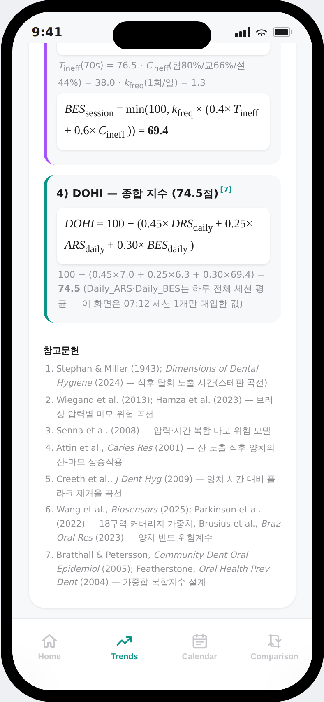

# 1. 이론적 배경: DOHI 산출 공식과 근거 문헌

DOHI(Daily Oral Health Index)는 스마트 칫솔 센서 데이터(압력·시간·커버리지)와 식이 행동 데이터(당 섭취 빈도·식품 산성도·양치 지연 시간)로부터 계산되는 세 하위 지표 — **DRS(탈회 위험)·ARS(마모 위험)·BES(양치 비효율)** — 를 가중합한 복합 지수다.

$$DOHI = 100 - (0.45 \times DRS + 0.25 \times ARS + 0.30 \times BES)$$

세 지표 모두 "높을수록 나쁨" 스케일로 통일되어 있어 별도의 반전 없이 그대로 가중합한다.

## 1.1 DRS — 탈회 위험 (Demineralization Risk Score)

그날의 식품 유형·당 섭취 빈도로 스테판 곡선(Stephan curve) pH 궤적을 직접 시뮬레이션하여, 구강 pH가 임계값 5.5 미만으로 떨어진 실제 누적 시간을 200분(5회 고산성 노출 × 40분의 최악 시나리오) 기준으로 정규화한다.

$$DRS = \min\left(100,\ \frac{T_{exposure}}{200} \times 100\right)$$

- 근거: **Stephan & Miller (1943)** — 식후 구강 pH 강하·회복 곡선(스테판 곡선)의 원 논문. **Dimensions of Dental Hygiene (2024)** — 식품군별 임계 pH·회복 시간 최신 임상 가이드.

## 1.2 ARS — 마모 위험 (Abrasion Risk Score)

브러싱 압력을 0N부터 완만히 증가하다 3.0N·3.9N을 기점으로 급격히 가팔라지는 구간별 위험 곡선으로 변환하고, 양치 시간·산성 식품 섭취 직후 조기 양치 시의 산-마모 상승작용 페널티를 반영한다.

$$P_{risk}(F) = \begin{cases} \frac{F}{3.0}\times 25 & F \le 3.0N \\ 25 + \frac{F-3.0}{0.9}\times 45 & 3.0N < F \le 3.9N \\ 70 + (F-3.9)\times 15 & F > 3.9N \end{cases}$$
$$ARS = \min\left(100,\ P_{risk}(F) \times \frac{t_{brush}}{120} \times k_{erosion}\right)$$

- 근거: **Wiegand et al. (2013)**, **Hamza et al. (2023)** — 브러싱 압력별 법랑질 마모 위험 곡선. **Senna et al. (2008)** — 압력·시간 복합 마모 위험 모델. **Attin et al., Caries Res (2001)** — 산 노출 직후 양치 시 산-마모 상승작용(erosion-abrasion synergy).

## 1.3 BES — 양치 비효율 (Brushing Efficiency Score, badness 스케일)

양치 시간 대비 잔존 플라크 비율과 18구역(협측 8·교합면 4·설측 6) 가중 커버리지 부족분을, 하루 양치 빈도에 따른 보정 계수와 함께 합산한다.

$$BES = \min\left(100,\ k_{freq} \times (0.4 \times T_{ineff} + 0.6 \times C_{ineff})\right)$$

- 근거: **Creeth et al., J Dent Hyg (2009)** — 양치 시간 대비 플라크 제거율 곡선. **Wang et al., Biosensors (2025)**, **Parkinson et al. (2022)** — 18구역 커버리지 가중치. **Brusius et al., Braz Oral Res (2023)** — 양치 빈도별 위험 보정 계수.

## 1.4 복합 지수 설계 및 가중치 근거

세 하위 지표를 하나의 지수로 합산하는 가중합 설계 자체는 **Bratthall & Petersson, Community Dent Oral Epidemiol (2005)**와 **Featherstone, Oral Health Prev Dent (2004)**의 복합 위험도 지수(composite caries-risk index) 설계 방법론을 따랐다. 0.45:0.25:0.30이라는 구체적 가중치는 이 문헌들이 공통적으로 강조하는 "탈회 위험(당대사·산 노출) > 물리적 마모 > 청결도" 순의 상대적 중요도를 반영해 설계 단계에서 정한 값이며, 이 가중치 배분이 실제로 임상 결과를 잘 예측하는지는 2장에서 통계적으로 검증한다.

## 1.5 코호트 생성 근거

통계 검증에 사용한 300인 합성 코호트는 각 사람의 180일 평균 행동 데이터(양치 시간·압력·빈도, 3영역 커버리지, 당 섭취 빈도, 식품 유형, 양치 지연 시간, 나이, 기저 ICDAS 점수)로 구성된다. 각 변수는 임상적으로 타당한 범위 내에서 정규/범주 분포로 생성했으며, 스테판 곡선의 회복 시간·임계 pH, 압력-위험 구간 경계값(3.0N/3.9N), 커버리지 가중치, 빈도 보정 계수는 위 1.1~1.3절과 동일한 문헌 근거를 그대로 사용했다. 다만 개별 코호트 변수(예: 양치 시간 평균 96.6초, 압력 평균 1.3N, 당 섭취 빈도 평균 4회/일)의 정규분포 모수 자체는 특정 논문에서 직접 인용한 값이 아니라, 위 문헌들이 제시하는 임상적으로 흔한 범위 안에서 시뮬레이션을 위해 보정한 값임을 밝혀둔다. ICDAS 진행 여부(우식 진행 시뮬레이션)도 등급(Excellent/Good/Fair/Poor)별로 서로 다른 확률(2%/8%/20%/45%)의 베르누이 시행으로 부여한 단순화된 가정이며, 특정 역학 연구에서 가져온 수치가 아니라 통계적 검증(2장의 ROC-AUC 분석)을 가능하게 하기 위한 설계상의 가정이다.

# 2. 통계 분석: DOHI가 유의미한 지수임을 검증

DOHI 설계가 임의로 정한 가중치·공식이 아니라 실제로 의미 있는 지수인지, 300인 합성 코호트에 대한 통계 분석으로 검증했다(`research/statistical_analysis.py`).

## 2.1 DOHI는 하위 지표 단독보다 임상 결과를 더 잘 예측하는가

DRS 계산 방식을 4가지 다른 방식(§2.4)으로 바꿔가며, 그때마다 "DRS 단독"과 "DRS를 반영해 재계산한 DOHI"가 실제 임상 결과 변수(`progressed`, 180일 후 ICDAS 우식 진행 여부)를 얼마나 잘 분리하는지 ROC-AUC로 비교했다.

| DRS 공식 | DRS 단독 AUC | 재계산 DOHI AUC | 개선폭 |
|---|---:|---:|---:|
| v1 (옛 선형 근사식) | 0.592 | 0.668 | +0.076 |
| v2 (실측 pH<5.5 누적 시간) | 0.639 | 0.721 | +0.082 |
| v3 (실측 pH-AUC 깊이 가중) | 0.638 | 0.692 | +0.055 |
| v4 (로지스틱 회귀 위험도) | 0.697 | 0.746 | +0.049 |

**어떤 DRS 공식을 쓰든 예외 없이, DRS 하나만 볼 때보다 ARS·BES와 합산한 DOHI로 볼 때 임상 결과를 더 잘 예측했다.** 이는 세 하위 지표를 결합하는 복합 지수 설계 자체가 특정 공식 선택과 무관하게 실질적인 예측력을 더한다는 근거다.

## 2.2 상관관계: DOHI는 무엇과 관련이 있는가

13개 변수에 대한 Pearson 상관분석 결과, DOHI와 절댓값 기준 상관이 가장 큰 변수는 **DRS(r=−0.820)**, **BES(r=−0.457)**, **양치 빈도(r=+0.429)** 순이었다(모두 하위 지표 설계 의도와 부합하는 방향). 나이·양치 시간·교합면 커버리지는 DOHI와 거의 무관했다(|r|<0.05) — 즉 DOHI는 임의의 노이즈가 아니라 설계 의도대로 행동 변수와 체계적으로 연관되어 있다.

## 2.3 행동 변수별 DOHI 차이: 양치 빈도는 유의, 나이는 비유의

- **양치 빈도**: ANOVA F=37.566 (p<0.0001), Kruskal-Wallis H=67.771 (p<0.0001) — 강하게 유의함. Tukey HSD 사후검정 결과 1회 vs 2회(+5.46점), 1회 vs 3회(+7.75점), 2회 vs 3회(+2.29점) 모두 유의한 차이(전부 p<0.05).
- (참고: 연령대별 차이는 유의하지 않았다 — ANOVA p=0.055, Kruskal-Wallis p=0.224.)

다중회귀분석(DOHI ~ 나이 + 양치빈도 + 당섭취빈도 + 양치시간 + 압력 + 지연시간 + 3커버리지, **R²=0.369**, N=300)에서 유의한 예측 변수(p<0.05)는:

| 변수 | 계수 | p-value |
|---|---:|---:|
| 양치빈도=2회 (기준 1회) | +4.79 | <0.0001 |
| 양치빈도=3회 (기준 1회) | +7.13 | <0.0001 |
| 당 섭취 빈도 | −1.07 | <0.0001 |
| 브러싱 압력(N) | −2.31 | <0.0001 |
| 설측 커버리지(%) | +0.06 | <0.0001 |
| 협측 커버리지(%) | +0.05 | 0.020 |

## 2.4 K-means 페르소나: 4개 유형이 통계적으로 더 타당

앱의 Comparison 탭에서 개인 궤적과 비교하는 4개 페르소나(과압마모형·당과다형·저위생형·균형형)는 임의로 나눈 것이 아니라, k=2~6에 대한 실루엣 점수 비교로 뒷받침된다. k=3(0.269)은 오히려 k=2(0.276)보다 낮았고 k=4(0.283)부터 다시 높아지는 경향을 보여, k=4를 최종 채택했다 — 이 결정 덕분에 세 위험 지표가 모두 평균 이하인 **균형형** 페르소나가 비교 대상으로 함께 제시될 수 있었다.

## 2.5 해석상 주의점

로지스틱 회귀(v4)는 같은 300명 데이터에 학습(fit)하고 같은 데이터로 평가한 in-sample 결과이므로, AUC가 가장 높게 나온 것은 "더 우월한 공식"이어서가 아니라 지도학습의 당연한 결과로 해석해야 한다. 또한 `progressed` 변수 자체가 이 코호트의 DOHI/등급으로부터 파생되었기 때문에, DRS 공식 비교(§2.1) 결과를 "어느 공식이 정답인가"가 아니라 "복합 지수 설계가 공식 선택과 무관하게 예측력을 더하는가"에 대한 민감도 분석으로 읽는 것이 적절하다.

# 3. 최종 앱: MoralGuard

이론적으로 설계하고(1장) 통계적으로 타당성을 확인한(2장) DOHI를, 가상 환자 "민재"의 180일 데이터를 보여주는 스마트폰 프레임 모바일 앱으로 구현했다. Home / Trends / Calendar / Comparison 4개 탭으로 구성된다.

## 3.1 Home — 오늘의 요약

오늘의 종합 DOHI, 양치 압력·구강 pH·커버리지 요약, 최근 브러싱 세션의 압력 변화 그래프를 한 화면에 보여준다.

## 3.2 Trends — 상세 분석 및 계산 과정

두 개의 실제 브러싱 세션(07:12, 22:41)을 선택해 압력·pH·커버리지 상세 그래프를 볼 수 있고, 화면 하단에는 1장의 공식을 그대로 오늘 데이터에 대입한 단계별 계산 과정과 참고문헌 목록을 제공해 "왜 이 점수가 나왔는지"를 투명하게 보여준다.

## 3.3 Calendar — 월별 추이

월별 캘린더에 등급별 색상 점을 표시하고, 날짜를 클릭하면 그날의 DRS·ARS·BES·DOHI 요약을 보여준다.

## 3.4 Comparison — 코호트 비교 및 개입 시뮬레이션

민재 개인의 180일 궤적을 2장에서 검증한 4개 페르소나 궤적과 겹쳐 그리고, 300명 코호트 분포 내 위치, 그리고 습관 개선 시나리오별 DOHI 변화 시뮬레이션까지 한 화면에서 이어서 보여준다.

# 4. 결론

- DOHI는 서로 다른 임상 근거를 가진 세 하위 지표(DRS·ARS·BES)를 문헌 기반 가중치로 결합한 지수이며, 어떤 DRS 계산 방식을 쓰든 하위 지표 단독보다 항상 임상 결과를 더 잘 예측했다 — 복합 지수 설계 자체의 타당성을 뒷받침한다.
- 양치 빈도는 DOHI에 가장 뚜렷하고 통계적으로 유의한 영향을 미치는 행동 변수였다.
- K-means 페르소나 분석은 통계적 근거(실루엣 점수)에 기반해 위험 유형 3종과 균형형 1종, 총 4개 유형으로 정리되었고, 이는 앱의 Comparison 탭에 그대로 반영되었다.
- 다만 통계 검증에 쓰인 `progressed`(우식 진행 여부)가 코호트 자체의 DOHI로부터 파생된 변수라는 한계가 있어, 결과는 "DOHI가 무작위가 아니라 설계 의도대로 작동한다"는 근거로는 충분하지만 "실제 임상적으로 검증된 지수"라고 확대 해석해서는 안 된다.
