# 1. 프로젝트 개요

본 프로젝트는 스마트 칫솔 센서 데이터(압력·시간·커버리지)와 식이 행동 데이터(당 섭취 빈도·식품 산성도·양치 지연 시간)를 결합하여 하루 단위 구강 건강 지수인 **DOHI(Daily Oral Health Index)** 를 산출하고, 이를 두 가지 형태의 웹 애플리케이션으로 구현했다.

- **OralGuard Dashboard**: 합성 300인 코호트(180일 평균 행동 데이터)를 생성·채점·분석하여 인구 집단 수준의 통계와 페르소나, 개입 시뮬레이션을 제공하는 6탭 대시보드.
- **MoralGuard 모바일 앱**: 가상 환자 "민재" 1인의 180일 일별 데이터와 세션 단위 상세 데이터를 보여주는 스마트폰 프레임 프로토타입(Home/Trends/Calendar/Comparison 4탭). Comparison 탭은 OralGuard의 코호트 결과를 재사용해 개인 대 집단 비교를 제공한다.

두 앱은 동일한 DRS(탈회 위험도) · ARS(마모 위험도) · BES(양치 비효율도) · DOHI 채점 방법론을 공유하도록 통일되어 있다(세부 내용은 3장 참고).

# 2. 앱 설계 과정

## 2.1 OralGuard Dashboard (6탭)

### 탭 1 — 오늘의 DOHI

코호트 평균에 가장 가까운 대표 환자(P0155) 1명을 뽑아, DOHI와 세 하위 지표(DRS·ARS·BES)를 반원 게이지로 보여준다. 각 게이지 아래에는 값에 따라 자동으로 바뀌는 한 줄 피드백 문구가 붙는다.

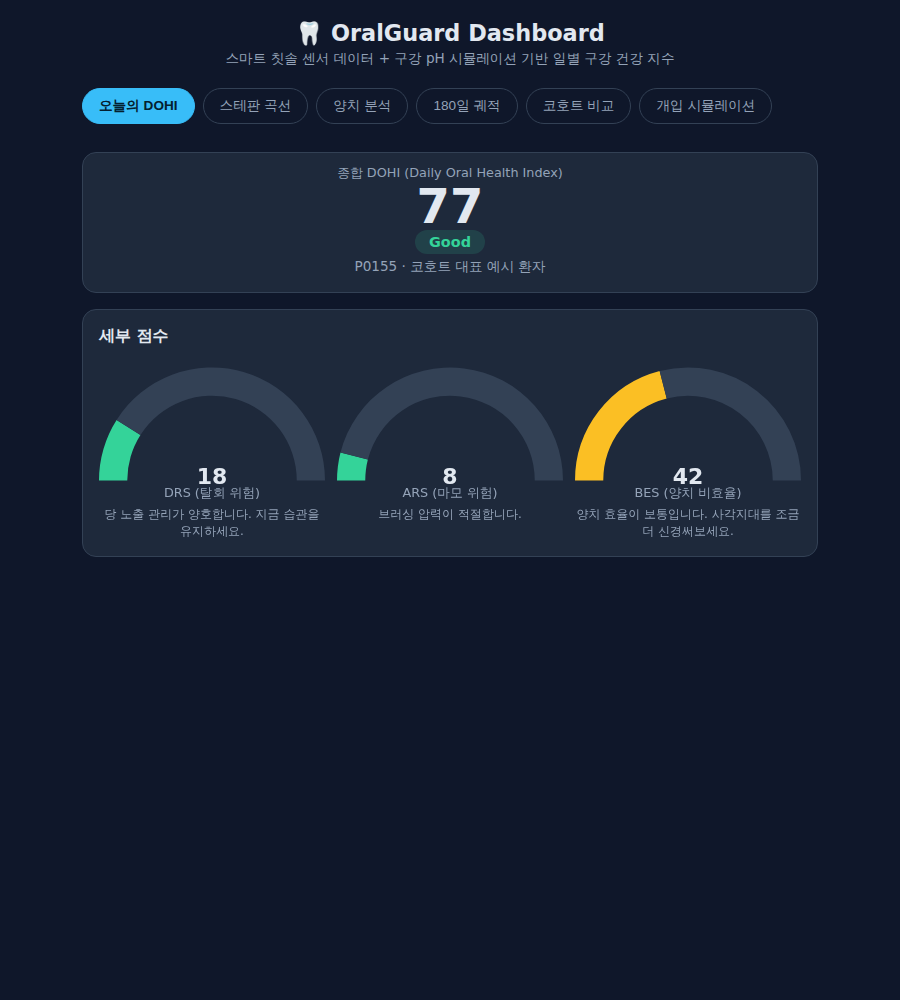

### 탭 2 — 스테판 곡선 시뮬레이터

식사 횟수·식품 산성도·양치 지연 시간 슬라이더를 조작하면, 그날의 구강 pH 변화(스테판 곡선)를 실시간으로 다시 그리고 pH 5.5 미만으로 떨어진 누적 시간(탈회 위험 노출 시간)을 계산해 보여준다.

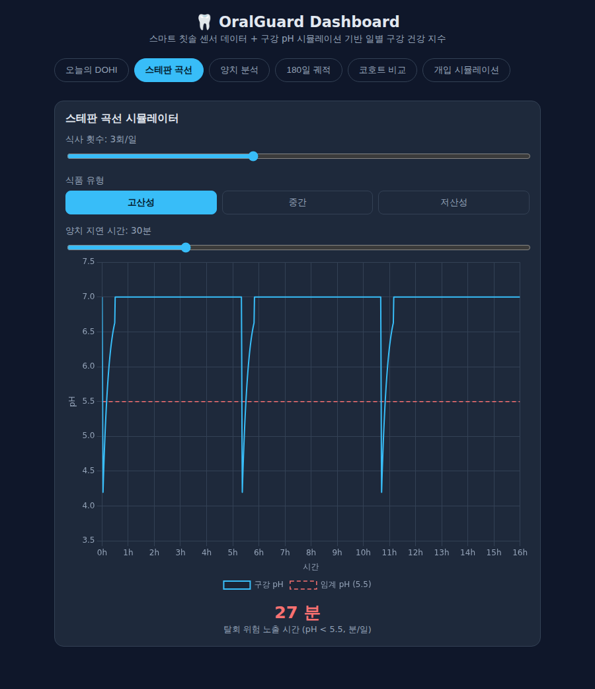

### 탭 3 — 양치 분석

18구역(협측 8·교합면 4·설측 6) 커버리지를 색상 히트맵으로, 브러싱 압력을 게이지로, 양치 시간을 권장 구간(120~180초) 음영이 표시된 바 형태로 보여준다.

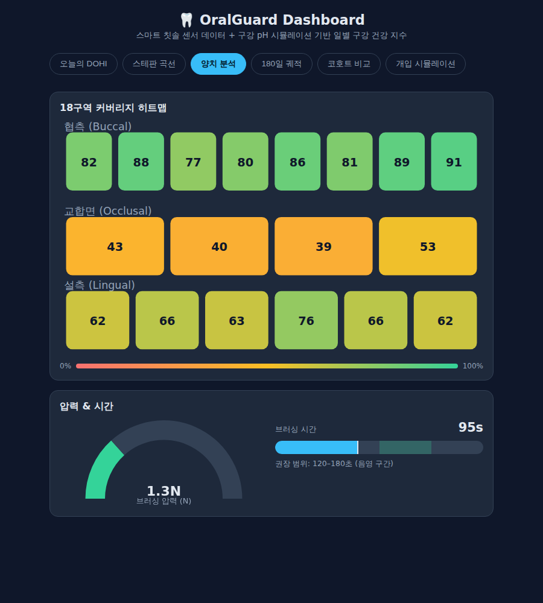

### 탭 4 — 180일 궤적

K-means로 분류한 4개 페르소나(과압마모형·당과다형·저위생형·균형형) 각각의 180일 DOHI 추이를 한 그래프에 겹쳐 보여주고, 아래에 페르소나별 평균 점수 카드를 나열한다.

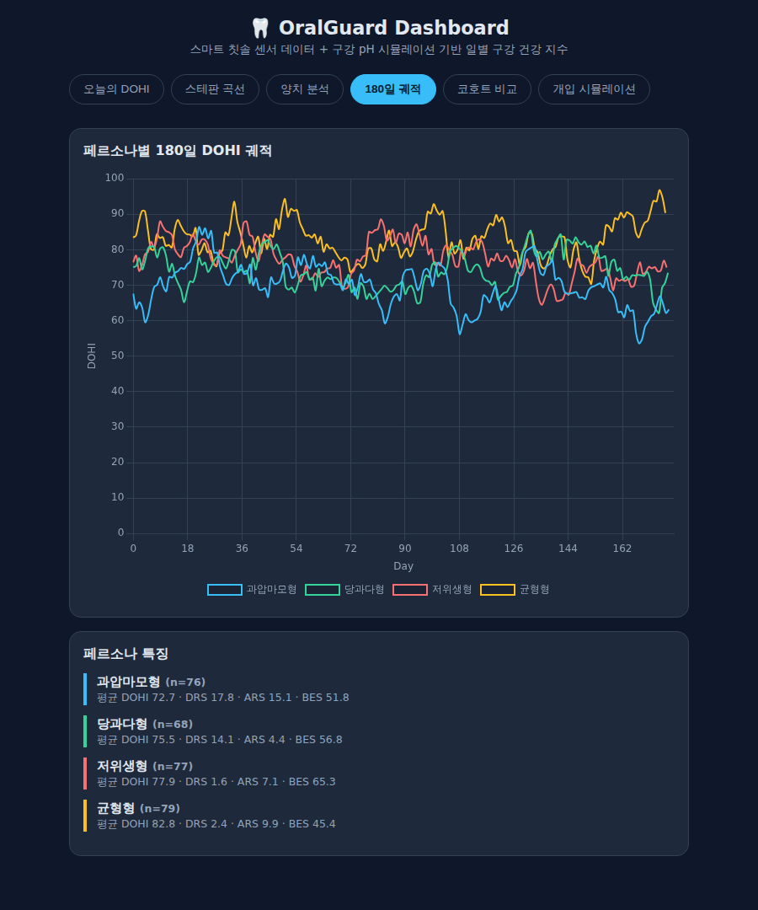

### 탭 5 — 코호트 비교

대표 환자의 DOHI가 300명 코호트 중 어느 위치(백분위)에 있는지 히스토그램과 등급 분포 도넛 차트로 보여준다.

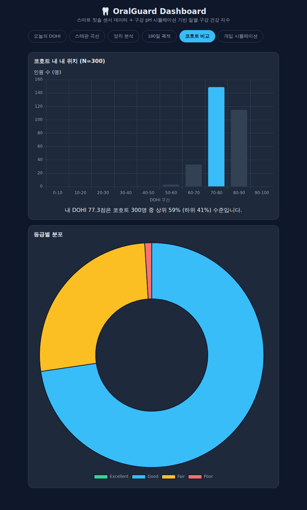

### 탭 6 — 개입 시뮬레이션

"양치 지연 30분 이상 대기(S1)", "양치 시간 45초→120초(S2)", "브러싱 압력 3N→1.5N(S3)" 세 가지 습관 개선 시나리오를 적용하기 전/후로 DRS·ARS·BES·DOHI가 어떻게 바뀌는지 막대그래프로 비교한다.

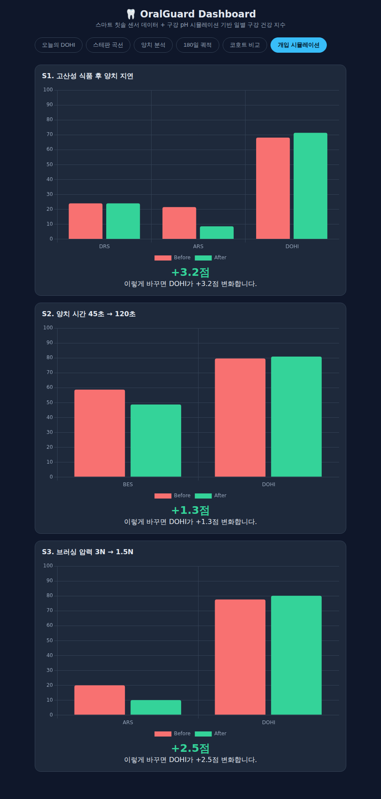

## 2.2 MoralGuard 모바일 앱 (4탭)

### Home

오늘 하루의 종합 DOHI, 양치 압력·구강 pH·커버리지 요약, 최근 세션의 압력 변화 그래프를 한 화면에 보여준다.

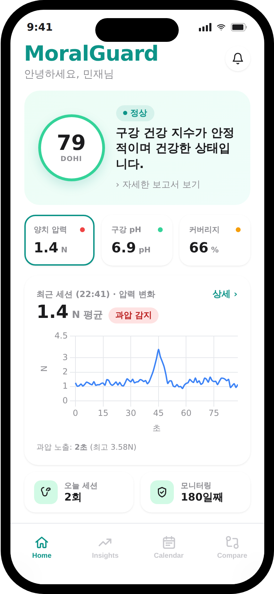

### Trends

두 개의 실제 브러싱 세션(07:12, 22:41)을 선택해 압력·pH·커버리지 상세 그래프와 DOHI 산출 공식의 단계별 계산 과정을 그대로 노출한다.

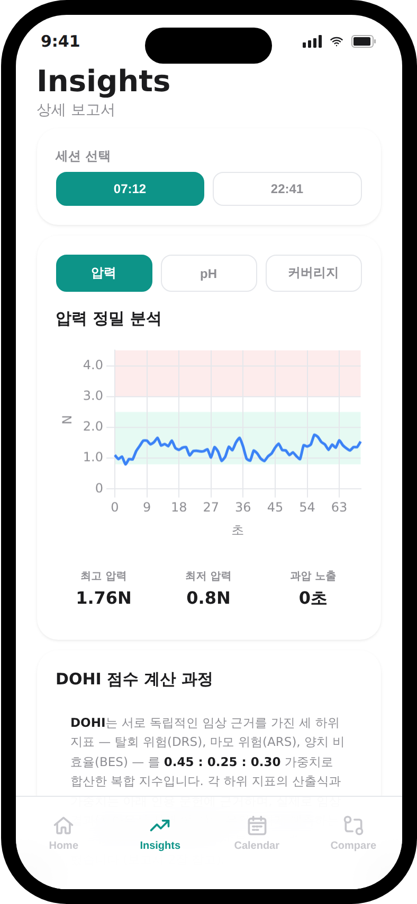

### Calendar

월별 캘린더에 등급별 색상 점을 표시하고, 날짜를 클릭하면 그날의 DRS·ARS·BES·DOHI 요약을 보여준다.

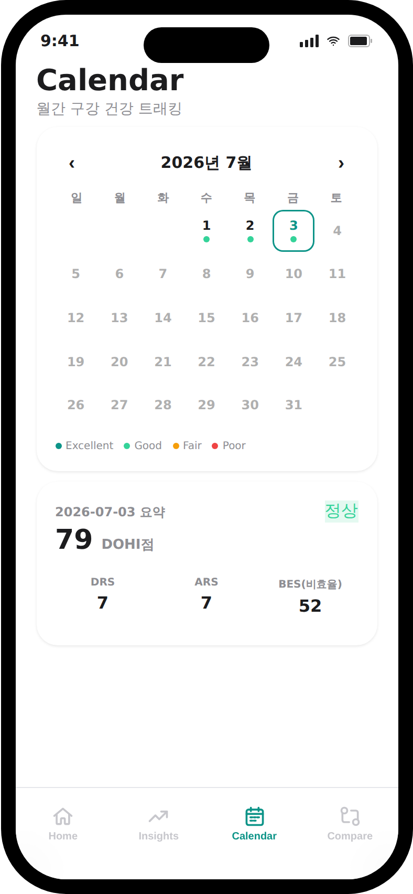

### Comparison

민재 개인의 180일 궤적을 OralGuard의 4개 페르소나 궤적과 겹쳐 그리고, 300명 코호트 분포 내 위치와 개입 시뮬레이션까지 한 화면에서 이어서 보여준다.

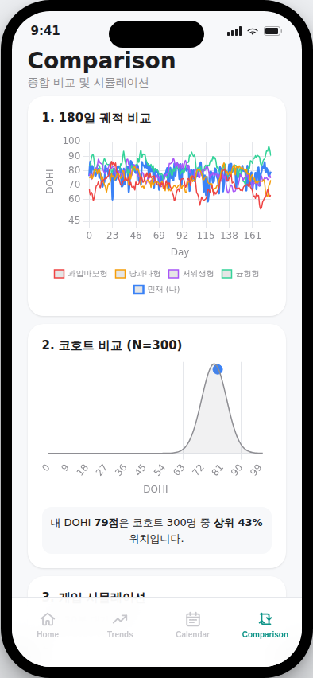

# 3. 데이터 및 채점 방법론

## 3.1 코호트 생성

`numpy` 정규분포/범주분포 기반으로 300명의 180일 평균 행동 데이터(양치 시간·압력·빈도, 3영역 커버리지, 당 섭취 빈도, 식품 유형, 양치 지연 시간, 나이, 기저 ICDAS 점수)를 생성한다(시드 고정, `scripts/generate_cohort.py`).

## 3.2 Session-first 채점 알고리즘

MoralGuard 모바일 앱에서 먼저 설계한 세션 단위 알고리즘을 OralGuard 300인 코호트에도 동일하게 이식했다(이전에는 코호트 파이프라인이 더 단순한 일 단위 근사식을 쓰고 있었음).

- **DRS (탈회 위험도)**: 그 사람의 식품 유형·당 섭취 빈도로 하루치 스테판 곡선 pH 궤적을 직접 시뮬레이션하여, pH 5.5 미만으로 떨어진 실제 누적 시간을 200분 기준으로 정규화.
- **ARS/BES (마모 위험도/양치 비효율도)**: 하루 브러싱 횟수만큼의 개별 세션을 각각 시뮬레이션(그 사람의 평균 압력·시간·커버리지 주변에 노이즈를 부여)하고, 세션별 점수를 평균하여 산출. 압력-위험 곡선은 0N부터 완만히 증가하다 3.0N·3.9N을 기점으로 급격히 가팔라지는 구간별 곡선을 사용.
- **DOHI**: `100 − (0.45×DRS + 0.25×ARS + 0.30×BES)` (BES는 DRS·ARS와 동일하게 "높을수록 나쁨" 스케일이므로 별도 반전 없이 그대로 가중합).
- **ICDAS 진행 시뮬레이션**: 등급(Excellent/Good/Fair/Poor)별로 다른 확률(2%/8%/20%/45%)의 베르누이 시행으로 180일 후 우식 진행 여부(`progressed`)를 부여 — 이는 회귀분석·ROC-AUC 평가의 정답(y) 변수로 쓰인다.

이 변경으로 이전에는 298/300명이 ARS=0으로 몰려 있던 문제(구 채점식의 압력 임계값이 2.5N 이하를 전부 0으로 처리)가 해소되어, ARS가 실제 변별력 있는 분포(평균 9.2, 표준편차 5.7)를 갖게 되었다.

# 4. 코호트 분석 결과 (전체 대시보드 파이프라인)

- **N = 300, DOHI 평균 77.33 (표준편차 5.83)**
- 등급 분포: Good 218명(72.7%) · Fair 79명(26.3%) · Poor 3명(1.0%) · Excellent 0명 — BES가 구조적으로 30점 이하로 잘 내려가지 않아 코호트/민재 개인 데이터 모두에서 Excellent 등급은 나타나지 않았다(포팅 이전 값이 아니라 알고리즘 자체의 구조적 특성).
- ICDAS 진행률: 전체 13.0%, 등급별로는 Good 8.26% → Fair 24.05% → Poor 66.67%로 단조 증가(등급이 실제 임상 결과와 잘 대응됨을 시사).

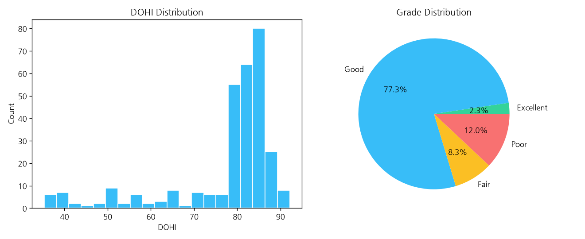

## 4.1 상관관계

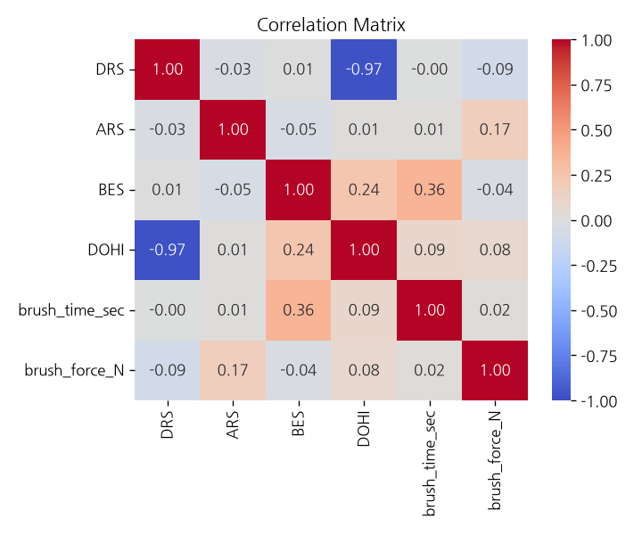

## 4.2 18구역 커버리지

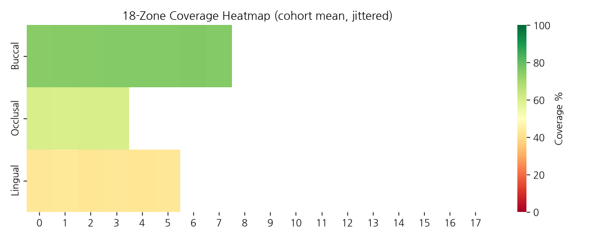

## 4.3 K-means 페르소나 (k=4)

k=3으로는 항상 DRS·ARS·BES 중 하나가 지배적인 "위험" 유형만 3개 나오고, 세 지표 모두 평균보다 낮은 "좋은 예시" 페르소나는 나타나지 않았다. k=4로 늘리자 실루엣 점수가 오히려 k=3(0.269)보다 k=4(0.283)에서 근소하게 높으면서, 동시에 세 위험 지표가 모두 평균 이하이고 DOHI가 가장 높은(82.85) **균형형** 페르소나가 자연스럽게 분리되었다.

| 페르소나 | n | DOHI 평균 | DRS 평균 | ARS 평균 | BES 평균 |
|---|---:|---:|---:|---:|---:|
| 과압마모형 | 76 | 72.67 | 17.83 | 15.09 | 51.80 |
| 당과다형 | 68 | 75.52 | 14.12 | 4.37 | 56.78 |
| 저위생형 | 77 | 77.89 | 1.64 | 7.09 | 65.34 |
| **균형형** | 79 | **82.85** | 2.39 | 9.89 | 45.35 |

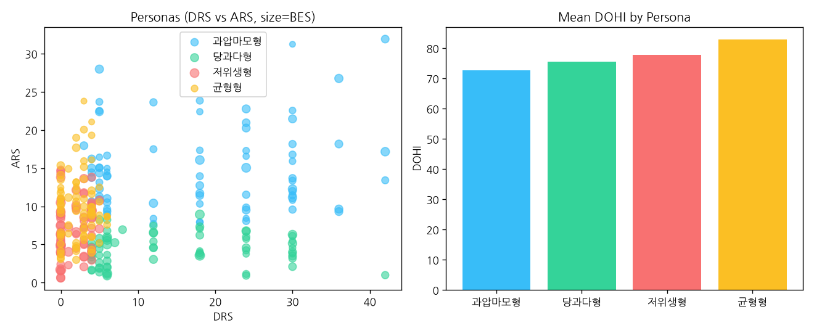

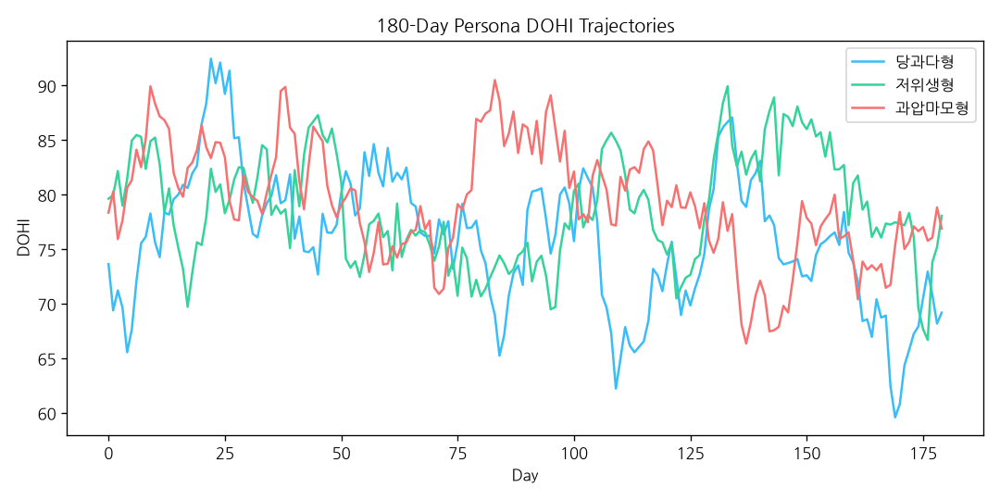

## 4.4 ROC-AUC (ICDAS 진행 예측력)

| 지표 | AUC |
|---|---:|
| DRS 단독 | 0.639 |
| BES 단독 | 0.594 |
| DOHI (종합) | **0.721** |

세 지표를 결합한 DOHI가 개별 하위 지표보다 진행 여부를 더 잘 구분해내며, 이는 복합 지수 설계의 타당성을 뒷받침한다.

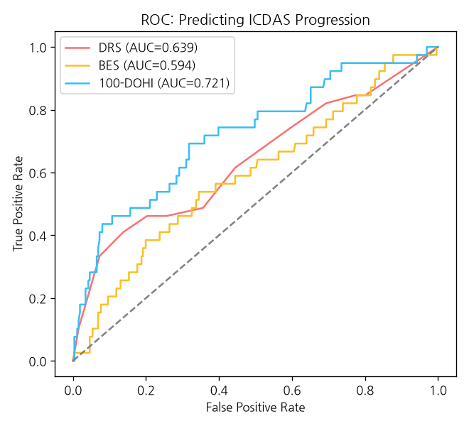

## 4.5 개입 시뮬레이션

| 시나리오 | 내용 | DOHI 변화 |
|---|---|---:|
| S1 | 고산성 식품 후 양치 지연 0분→30분 | **+3.22점** |
| S2 | 양치 시간 45초→120초 | +1.31점 |
| S3 | 브러싱 압력 3N→1.5N | +2.48점 |

세 습관 교정 중에서는 "산성 식품 섭취 직후 양치를 미루기"의 개선 효과(+3.22점)가 가장 크게 나타났다.

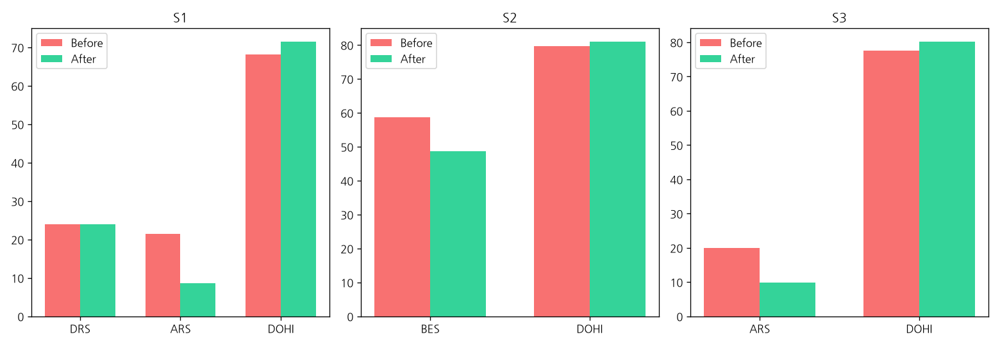

# 5. 통계 분석 심화 (research/statistical_analysis.py)

과제의 통계 분석 요건에 맞춰, 위 대시보드 파이프라인과는 별도로 300인 코호트에 대한 심화 통계 분석을 진행했다(앱에는 통합하지 않은 독립 연구용 스크립트).

## 5.1 상관계수 (13개 변수)

DOHI와 절댓값 기준 상관이 가장 큰 변수는 **DRS (r=−0.820)**, 그다음이 **BES (r=−0.457)**, **양치 빈도 (r=+0.429)** 순이었다. 나이·양치 시간·교합면 커버리지는 DOHI와 거의 무관했다(|r|<0.05).

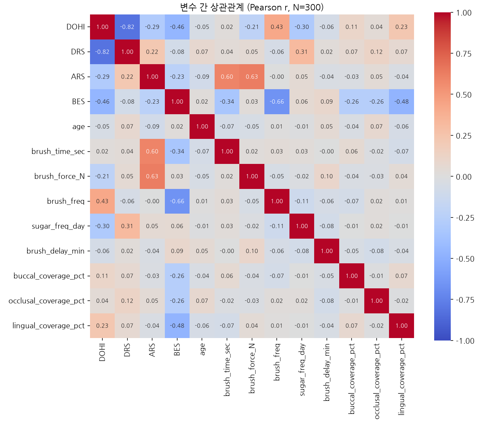

## 5.2 K-means k 선택 검증

k=2~6에 대해 실루엣 점수를 비교한 결과 k=3(0.269)은 k=2(0.276)보다도 낮았고, k=4(0.283)·k=5(0.296)·k=6(0.302)로 갈수록 오히려 계속 높아지는 경향을 보였다. 이 결과가 이후 대시보드의 페르소나 수를 3에서 4로 조정하는 근거가 되었다(4.3절 참고).

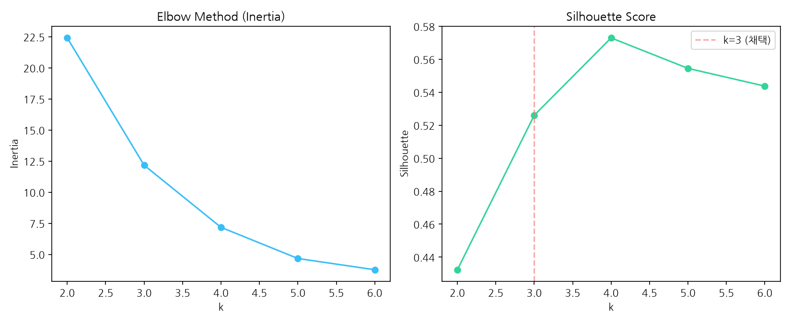

## 5.3 인구·양치 빈도별 DOHI 비교

- **연령대별**: ANOVA F=2.344 (p=0.055), Kruskal-Wallis H=5.681 (p=0.224) — 두 검정 모두 유의하지 않음. 나이는 DOHI에 뚜렷한 영향을 주지 않는다.
- **양치 빈도별**: ANOVA F=37.566 (p<0.0001), Kruskal-Wallis H=67.771 (p<0.0001) — 강하게 유의함. Tukey HSD 사후검정 결과 하루 1회 vs 2회(+5.46점), 1회 vs 3회(+7.75점), 2회 vs 3회(+2.29점) 모두 통계적으로 유의한 차이를 보였다(전부 p<0.05).

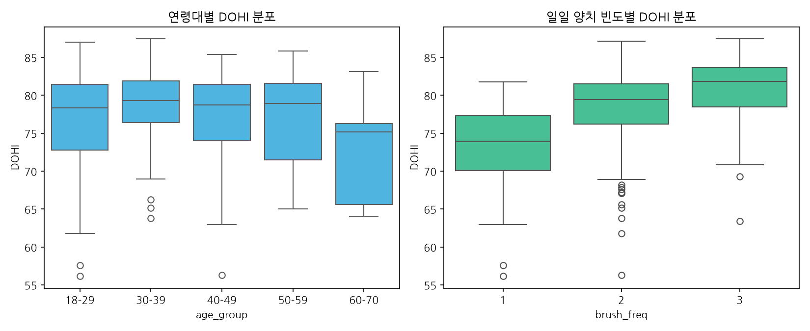

**다중회귀분석** (DOHI ~ 나이 + 양치빈도 + 당섭취빈도 + 양치시간 + 압력 + 지연시간 + 3커버리지, R²=0.369, N=300)에서 유의한 예측 변수는:

| 변수 | 계수 | p-value |
|---|---:|---:|
| 양치빈도=2회 (기준 1회) | +4.79 | <0.0001 |
| 양치빈도=3회 (기준 1회) | +7.13 | <0.0001 |
| 당 섭취 빈도 | −1.07 | <0.0001 |
| 브러싱 압력(N) | −2.31 | <0.0001 |
| 설측 커버리지(%) | +0.06 | <0.0001 |
| 협측 커버리지(%) | +0.05 | 0.020 |

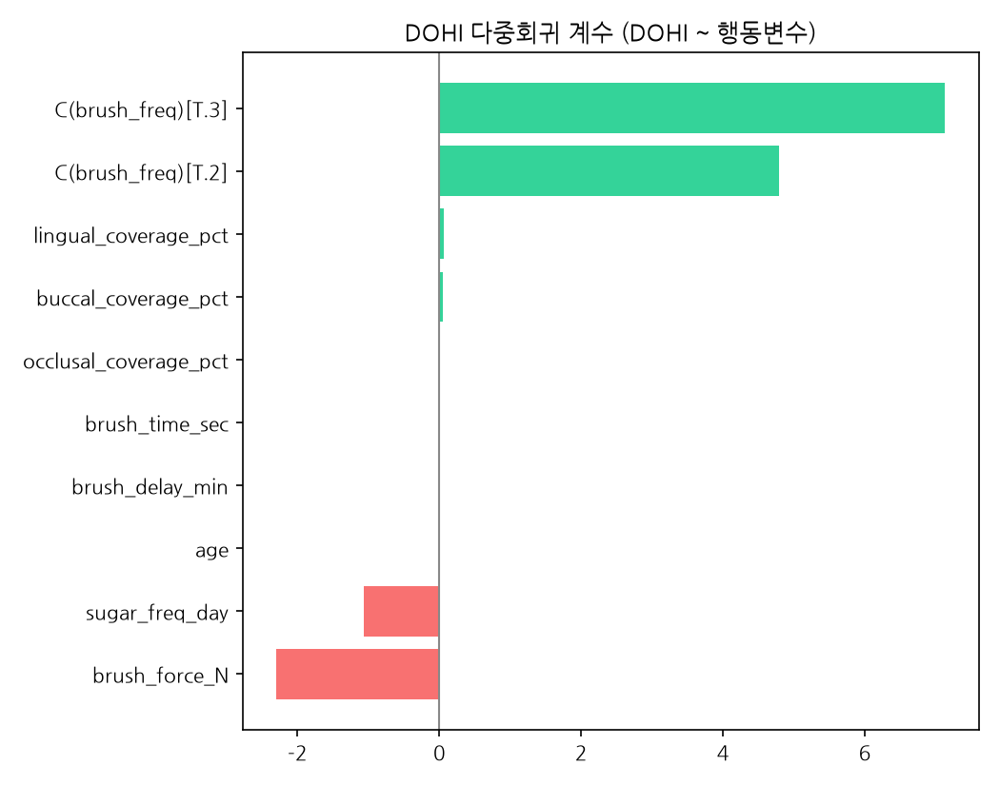

## 5.4 DRS 공식 대안 비교 (자체 제안 분석)

기존 DRS 계산 방식을 4가지 방식으로 바꿔가며 실제 임상 결과(`progressed`, ICDAS 진행 여부)를 얼마나 잘 분리하는지 ROC-AUC·Cohen's d·Kolmogorov-Smirnov로 비교했다.

| 공식 | 설명 | AUC(DRS 단독) | Cohen's d |
|---|---|---:|---:|
| v1 | 옛 선형 근사식(포팅 전 코호트 공식) | 0.592 | 0.342 (작음) |
| v2 | 실측 pH<5.5 누적 시간(현재 코호트 공식과 동일 방식) | 0.639 | 0.733 (중간) |
| v3 | 실측 pH-AUC(깊이 가중) | 0.638 | 0.669 (중간) |
| v4 | 로지스틱 회귀 기반 위험도 | **0.697** | 0.788 (중간) |

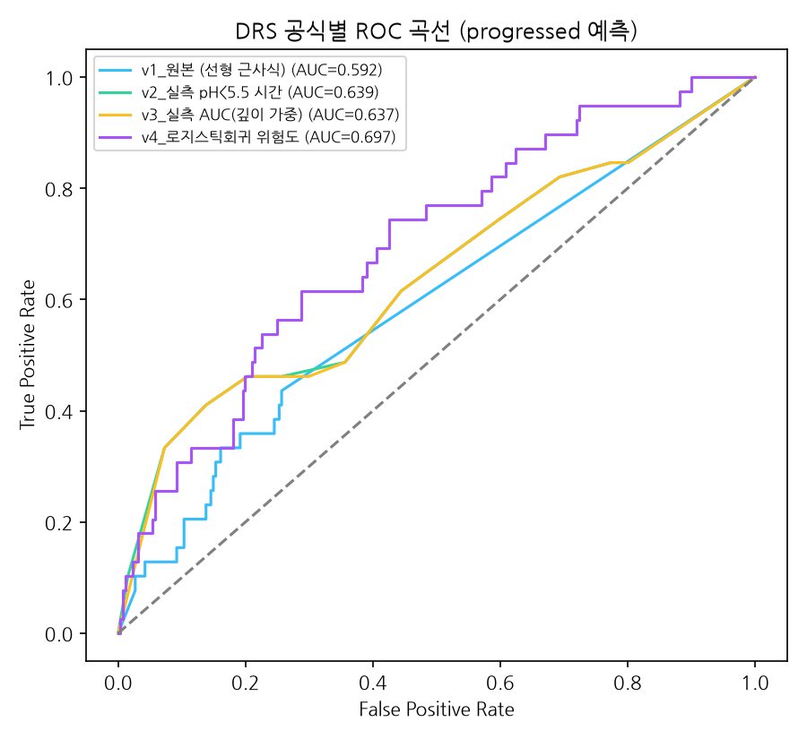

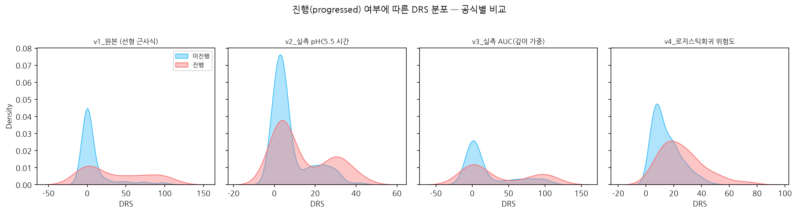

**해석상 주의점**: v4(로지스틱 회귀)는 같은 300명 데이터에 학습(fit)하고 같은 데이터로 평가한 in-sample 결과이므로, AUC가 가장 높게 나오는 것은 "더 우월한 공식"이어서가 아니라 지도학습의 당연한 결과다. 또한 `progressed` 변수 자체가 이 코호트의 DOHI/DRS로부터 파생되었기 때문에(등급 → 진행확률 결정), v2 계열 공식이 실제 채점 로직과 방법론적으로 가장 가까워 약한 잔여 순환성이 남아있다. 따라서 이 비교는 "어느 공식이 정답인가"가 아니라 "DRS 공식 선택이 최종 결과에 얼마나 민감한가"를 보여주는 민감도 분석으로 해석하는 것이 적절하다.

# 6. 결론 및 한계

- DOHI는 세 하위 지표를 결합함으로써 각 하위 지표 단독보다 임상 결과(ICDAS 진행)를 더 잘 예측했다(AUC 0.721 vs 0.594~0.639).
- 양치 빈도는 DOHI에 가장 뚜렷하고 통계적으로 유의한 영향을 미치는 행동 변수였으며, 나이는 유의한 영향이 없었다.
- K-means 페르소나 분석은 세 가지 위험 유형(당과다·저위생·과압마모)뿐 아니라, 세 위험 지표가 모두 낮은 균형형 유형까지 함께 제시함으로써 비교 대상으로서의 완결성을 갖추었다.
- **한계 1 (순환성)**: `progressed`(우식 진행 여부)가 코호트 자체의 DOHI/등급으로부터 파생된 변수이기 때문에, DRS 공식 비교 결과를 "실제 임상적 우수성"의 증거로 확대 해석해서는 안 된다.
- **한계 2 (구조적 상한)**: 현재 채점식에서는 BES가 이론상 30점 이하로 잘 내려가지 않아 "Excellent" 등급이 이 코호트/민재 개인 데이터 모두에서 나타나지 않았다. 이는 향후 BES 정규화 기준 재보정이 필요할 수 있음을 시사한다.
- **한계 3 (스케일 압축)**: DRS 공식 비교에서 실측 시뮬레이션 기반 변형(v2·v3)은 옛 선형 근사식(v1)보다 0-100 스케일을 더 좁게 사용하는데, 이는 정규화 상한(200분/AUC 상한)이 새 공식의 실제 달성 가능 범위에 맞춰 재보정되지 않았기 때문일 수 있다.
